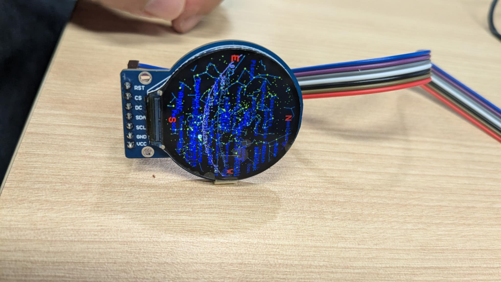
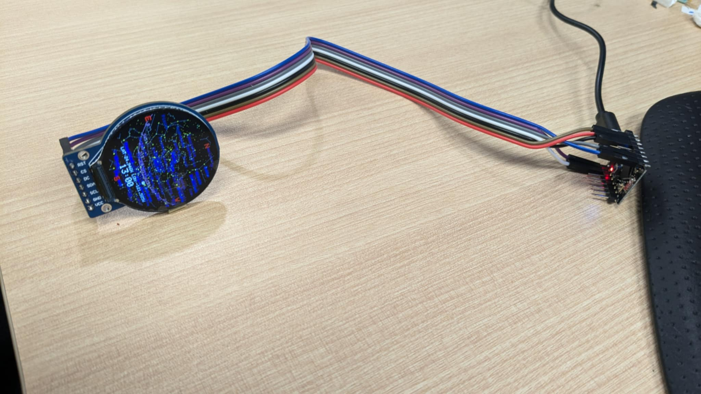
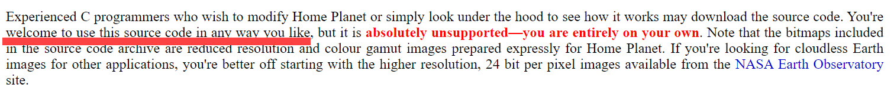

 

# starmap

The code in this repository is a star/planets engine in an Arduino library.

# Change Notes

What i want is to test this awesome project on a minial settings. You should install the starmap library from shabaz123 first. I use Nologo ESP32C3 Super Mini to connect with GC9A01 LCD but it should work with any other ESP32 or maybe even ESP8266 ( need change Wifi library)
- Using GeoIP library for approximated lattitude and longtitude as well as current timezone. Thanks to https://github.com/mmarkin/GeoIP/tree/main 
- Using NTP to update time
- Store Yale star map as variable on flash ( for 4MBit Flash, default partition will reach 97% of program flash, with NoOTA 2MB/2MB scheme, it will be around 60%)
- Remove all satellite and flags parts ( maybe will try to find a way in future to add this feature back)

**** Remember to change the ssid1/password1 and ssid2/password2 to your own.
## Acknowledgement

Note: This code uses content from https://www.fourmilab.ch/homeplanet/ (public domain code).

See the screenshot here:

